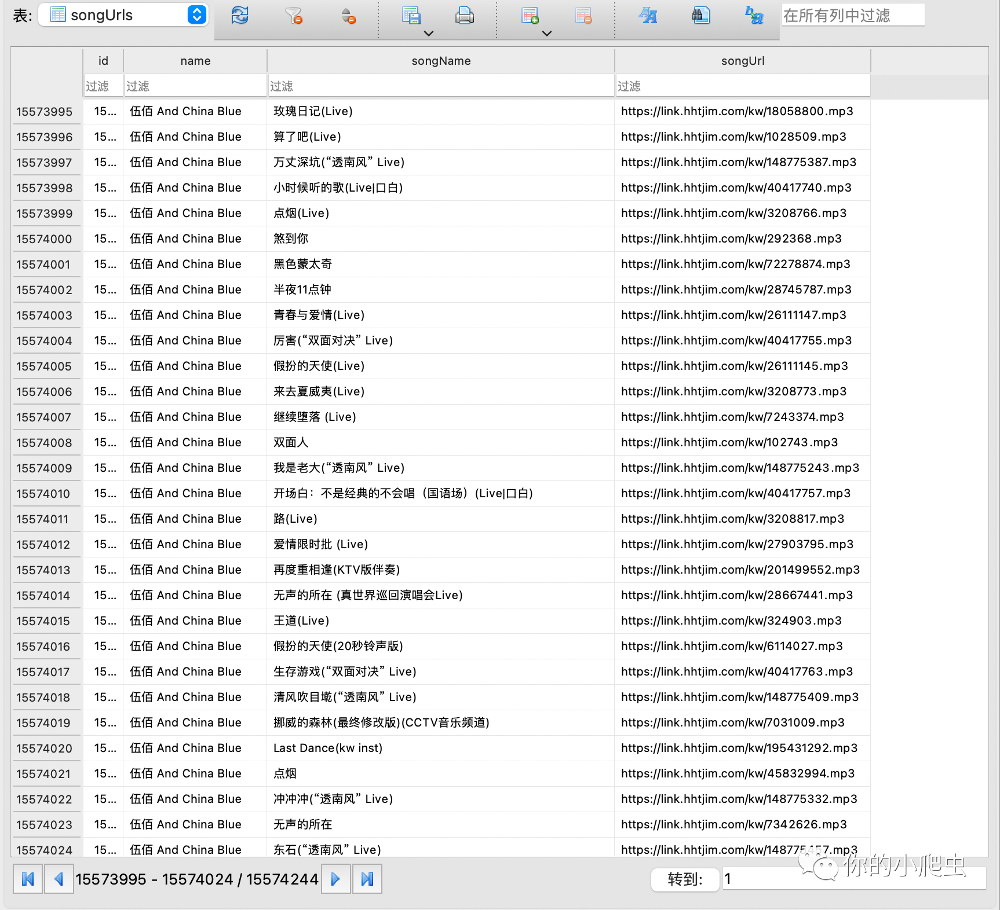

# KuWoSpider
#### 利用feapder框架对酷我音乐大概一千三百万歌曲进行全栈爬取

<h3>使用：</h3>
<ul>
    <li>安装：git clone https://github.com/hardandkeep/KuWoMusic_Spider</li>
    <li>可使用命令行运行：python -m kuwo_spider</li>
    <li>可使用easy_to_run.py文件去运行KuWoSpider</li>
</ul>

<h3>爬取结果：</h3>

